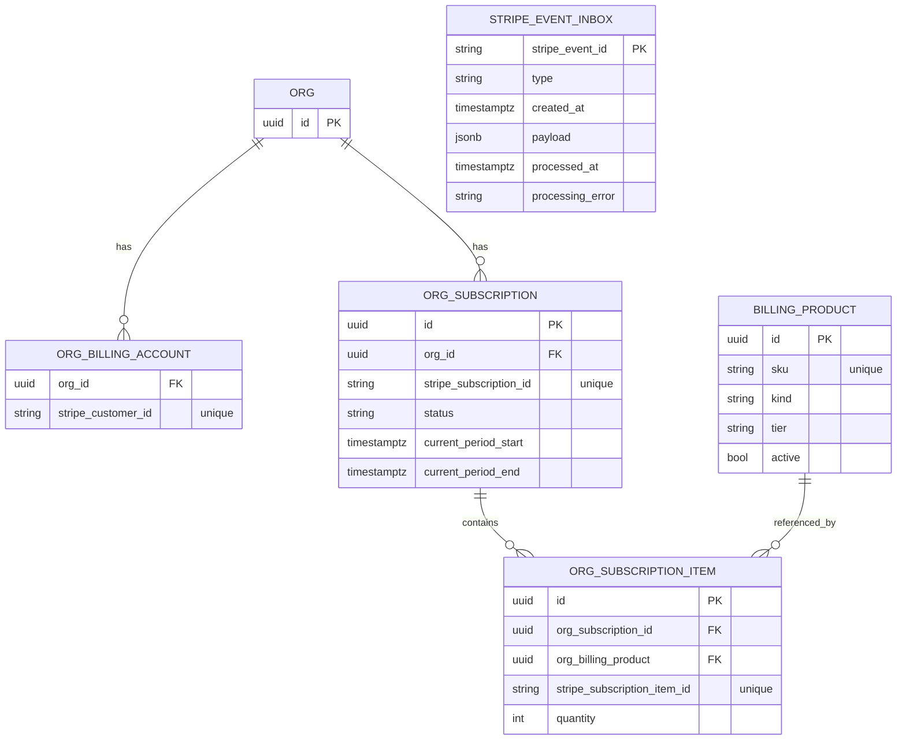
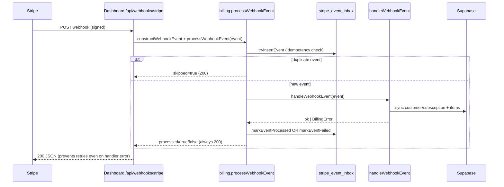
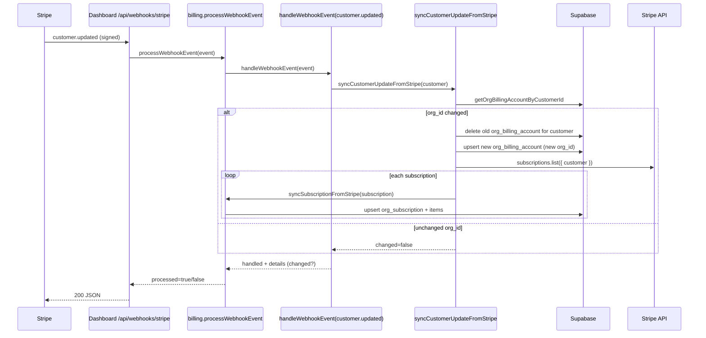

# @fern-platform/billing Overview

This package centralizes Fern’s billing logic: Stripe client setup, database accessors, webhook processing, and helpers for syncing subscriptions and customers.

## Environment
- `STRIPE_SECRET_KEY` — required for any Stripe API calls.
- `STRIPE_WEBHOOK_SECRET` — webhook signature verification (config in dashboard); optional override can be passed to `constructWebhookEvent`.

## Data Model (ER)

## Webhook Flow

### Customer Updated (org transfer) Flow

## Key APIs
- `getStripeClient()` / `constructWebhookEvent(payload, sig, secret?)`
- Idempotency: `withIdempotency(event, handler)`
- Sync: `syncSubscriptionFromStripe`, `syncCustomerFromStripe`, `syncCustomerUpdateFromStripe`
- Routing: `handleWebhookEvent`
- Entry point: `processWebhookEvent`
- DB helpers live under `src/db/*.ts`.

## Tests
- `pnpm --filter=@fern-platform/billing test` (Vitest)
- Webhook route tests in dashboard: `pnpm --filter=@fern-dashboard/ui test -- --testNamePattern=webhooks/stripe`

## Build
- `pnpm --filter=@fern-platform/billing compile`
