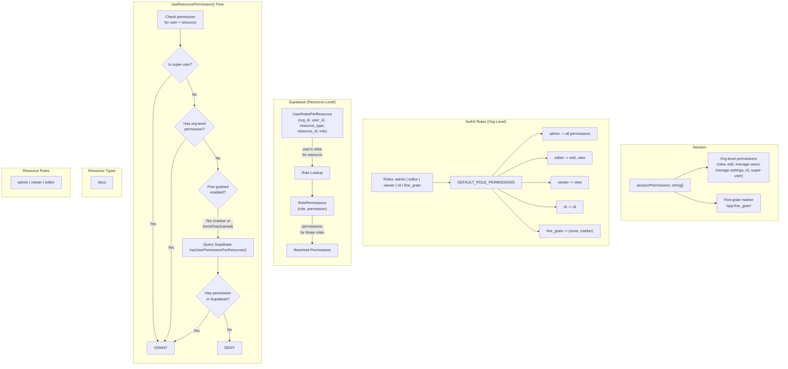

# @fern-api/user-permissions

A shared permissions library for the Fern platform that provides both org-level (Auth0-backed) and resource-level (Supabase-backed) authorization, with support for fine-grained per-resource access control and OIDC group-based permission syncing.

## Architecture Overview



## Source Files

| File | Description |
|------|-------------|
| `permissions.ts` | Core permission-checking logic: `hasResourcePermission`, `hasRoutePermission`, `getPermittedResourceIds`, scoped permission parsing |
| `resource-permissions.ts` | Supabase-backed CRUD for resource-level roles and permissions (`UserRolesPerResource`, `RolePermissions` tables) |
| `roles.ts` | Auth0-backed org-level role management (`addRoles`, `removeRoles`, `getRoles`) |
| `user-permissions.ts` | Low-level Auth0 user permission assignment (`addPermission`, `removePermission`) |
| `oidc-permissions.ts` | OIDC group-to-role mapping and permission syncing from IdP groups |
| `errors.ts` | Error types for Auth0 and Supabase operations |
| `client.ts` | Auth0 Management API client initialization |

## Key Concepts

### 1. The `app:fine_grain` Discriminator

The constant `FINE_GRAIN_PERMISSION = "app:fine_grain"` acts as a feature flag in the session. When present in `sessionPermissions`, the system switches from session-based scoped permission strings to Supabase-backed resource-level lookups.

```ts
// resource-permissions.ts
export const FINE_GRAIN_PERMISSION = "app:fine_grain" as const;
```

### 2. Permission Checking Order

The core function `hasResourcePermission()` follows a strict cascade:

1. **super-user** — grants everything immediately
2. **Org-level permission** (from session) — grants access to all resources of that type
3. **Fine-grained enabled** (`app:fine_grain` in session or `forceFineGrained` flag) — queries Supabase `UserRolesPerResource` + `RolePermissions` tables

### 3. Scoped Permission Strings

When fine-grained is **not** enabled, permissions are encoded as strings in the format `permission:resourceType:resourceId` (e.g., `edit:docs:my-doc-site`). These are parsed/created by `parseScopedPermission()` and `createScopedPermission()`.

```ts
type ScopedPermissionString = `${AuthZPermission}:${ResourceType}:${string}`;
// Example: "view:docs:my-doc-site-id"
```

### 4. Supabase Data Model

Two tables back the resource-level permissions:

- **`UserRolesPerResource`** — maps `(org_id, user_id, resource_type, resource_id)` → `role`
- **`RolePermissions`** — maps `role` → `permission`

The lookup in `getUserPermissionsForResource()` first fetches the user's roles for a resource, then resolves those roles to permissions via an `IN` query.

### 5. Auth0 Role / Fine-Grain Mutual Exclusion

When an org-level role (`admin`, `editor`, `viewer`) is assigned via `addRoles()`, the `fine_grain` role is automatically removed, since org-level permissions supersede resource-scoped ones. Sessions are also invalidated to force re-authentication with updated permissions.

### 6. Default Role Permissions

Each Auth0 role maps to a default set of `AuthZPermission` values, used as a fallback when the token hasn't been refreshed yet:

| Role | Permissions |
|------|-------------|
| `admin` | `view`, `edit`, `manage-users`, `manage-settings`, `cli`, `super-user` |
| `editor` | `edit`, `view` |
| `viewer` | `view` |
| `cli` | `cli` |
| `fine_grain` | *(none — permissions come from Supabase)* |

### 7. Route-Level Integration

`hasRoutePermission()` ties this into middleware by matching URL patterns (`RoutePermissionConfig`) to required permissions, optionally extracting a resource ID from the URL via regex capture groups for resource-scoped checks.

```ts
interface RoutePermissionConfig {
    pattern: RegExp;
    requiredPermission: AuthZPermission;
    resourceScope?: {
        resourceType: ResourceType;
        captureGroup: number; // regex capture group index for resource ID
    };
}
```

### 8. OIDC Group Permission Syncing

The `syncOidcPermissions()` function synchronizes permissions based on a user's IdP (Identity Provider) groups:

1. Fetches the user's OIDC groups from Auth0 `app_metadata`
2. Looks up group-to-role mappings in the Supabase `OidcGroupMappings` table
3. Applies the highest-privilege role for org-level mappings
4. Applies the highest-privilege role per resource for resource-level mappings
5. Removes any existing permissions not covered by current mappings

Role priority: `viewer (1)` < `editor (2)` < `admin (3)` — highest privilege wins.

### 9. Error Handling

All functions come in two variants:
- **Throwing** (e.g., `getUserRoles()`) — throws on error
- **ResultAsync** (e.g., `getUserRolesResult()`) — returns `ResultAsync<T, UserPermissionsError>` using the `neverthrow` library

Error types are discriminated by `source`:
- `Auth0Error` — codes: `NOT_CONFIGURED`, `API_FAILED`, `ROLE_MAPPING_INVALID`
- `SupabaseError` — codes from `@fern-platform/supabase`

## AuthZ Permissions

The full set of permission types:

```ts
const AUTHZ_PERMISSIONS = ["view", "edit", "manage-users", "manage-settings", "cli", "super-user"] as const;
```

## Resource Types

Currently supported resource types:

```ts
const RESOURCE_TYPES = ["docs"] as const;
```

## Environment Variables

- `AUTH0_ROLES` — JSON string mapping role names to Auth0 role IDs (e.g., `{"admin":"rol_xxx","editor":"rol_yyy",...}`)
- Supabase connection config is provided via `@fern-platform/supabase`
