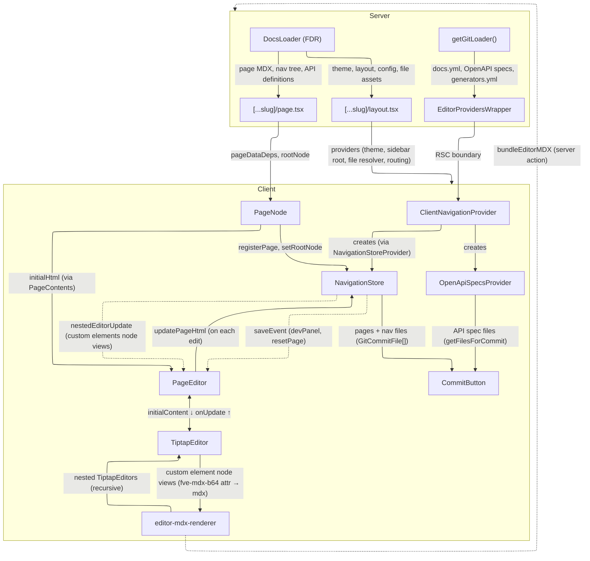
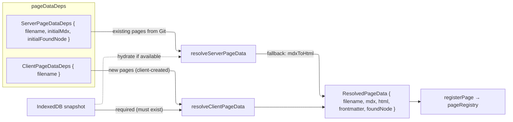
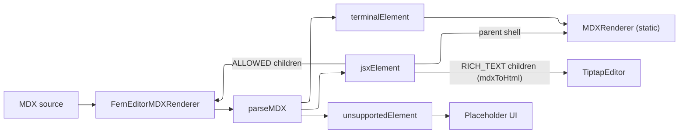
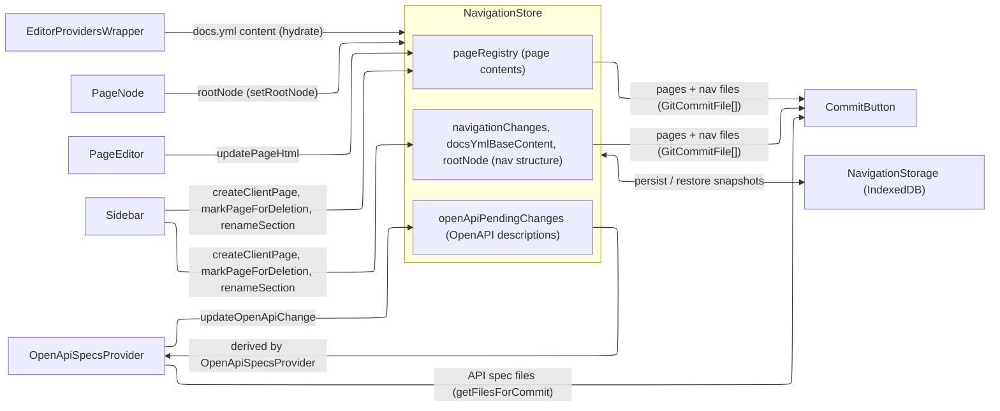

# @fern-dashboard/src/components/editor

<!-- AI: Update the date below when modifying this file -->
*Last updated by AI: 2026-02-11*

WYSIWYG editor for Fern documentation pages. Supports editing page content (MDX, including `FERN_COMPONENTS`), managing site navigation (docs.yml), and editing API reference descriptions (OpenAPI overrides) — all committed back to Git.

**When a user opens an editor session** → a unique branch is created off of `main` on GitHub/GitLab → server fetches latest docs data from FDR (snapshotted then cached in MongoDB) and specific raw source files from Git (docs.yml, OpenAPI specs) → Tiptap renders MDX as editable blocks → edits are tracked in NavigationStore → user clicks Commit → changes are pushed as a commit to the branch and a PR is created.

## Architecture

### Key Dependencies

| Package | Used by | For |
|---------|---------|-----|
| `@fern-docs/mdx` | `editor-mdx-renderer` | `mdxToAST` — parses raw MDX into element AST |
| `@fern-docs/mdx` | `NavigationStore`, `editor-mdx-renderer` | `htmlToMdx` / `mdxToHtml` — round-trips HTML↔MDX on each edit |
| [`@fern-docs/components`](../../../../fern-docs/components/README.md) | [`src/docs/`](../../docs/README.md), editor components | Shared UI primitives (`Prose`, `FernBreadcrumbs`, etc.) |
| [`src/docs/`](../../docs/README.md) ([@fern-docs/bundle](../../../fern-docs/bundle/README.md) fork) | `editor-mdx-renderer` | `MDX_COMPONENTS` map (`Callout`, `Card`, `Tab`, etc.) — provided via `useMDXComponents()` for rendering bundled MDX |

### Page Data (`[...slug]/page.tsx`)

**Node type dispatch:** `page.tsx` routes by node type. API reference nodes (e.g. `endpoint`, `webSocket`, `webhook`, `grpc`) render via dedicated wrappers (e.g. `ApiEndpointPageWrapper`). Changelog nodes have their own wrappers. Only `page` and `section overview` nodes flow through `PageNode` → `PageEditor` → `TiptapEditor` as described below.

`page.tsx` passes `pageDataDeps` to `PageNode`, which calls `resolveInitialPageData()` (dispatches to server/client resolver by `source`) → `registerPage()` into NavigationStore's `pageRegistry`:

**Dirty tracking** (`PageEditor`): On each Tiptap update, `getChangedNodesFromHtml` diffs the previous and current HTML to identify changed node IDs. These are accumulated in a `dirtyNodeIds` ref (once dirty, always dirty for the session) and passed to `updatePageHtml` so NavigationStore knows which nodes were edited. `PageEditor` also subscribes to `saveEvent` (devPanel MDX edits) and `nestedEditorUpdate` (custom element node view changes).

### TiptapEditor & Extensions (`TiptapEditor.tsx`)

`TiptapEditor.tsx` configures the Tiptap extension stack and is the actual editing surface. Some key extensions beyond `StarterKit`:
- `CustomElement`/`InlineCustomElement` (MDX components — see below)
- `FVEAttributesExtension` (`fve-data-id`/`fve-mdx-b64` global attributes for round-trip tracking)

**Cross-editor drag isolation:** Nested editors (from custom element node views) each get a unique `data-editor-id`. Drag events between different editor IDs are blocked via `dragover`/`drop` handlers.

**Toolbar UI:** `NodeHoverHandle` (block-based drag + actions), `FloatingMenu` (slash command menu), `TextBubbleMenu` (inline formatting).

### Custom Element Bridge (`extension-custom-element/`)

Custom elements bridge Tiptap's document model with MDX components (Callout, Card, Tab, etc.). The `custom-element-v2` Tiptap node stores MDX source as base64 in its `fve-mdx-b64` attribute.

`CustomElementNodeView` (block) and `InlineCustomElementNodeView` (inline, passes `inline={true}`) both decode `fve-mdx-b64` → render via `FernEditorMDXRenderer` → which may spawn nested `TiptapEditor`s for `RICH_TEXT` children. On edits, updated MDX is re-encoded to base64 and `emitNestedEditorUpdate` notifies `PageEditor`. New custom elements are created via `create-custom-element-node.ts`.

### MDX Rendering (`editor-mdx-renderer/`)

How MDX source is parsed, bundled, and rendered in the editor:

1. **Parsing** — `parse.ts` converts MDX to AST (via `mdxToAST`) and classifies nodes into `ParsedMarkdownElement[]`.
2. **Bundling** — Terminal elements and JSX parent shells are bundled via `cachedBundleMDX` → `bundleEditorMDX` → `bundle.ts`. Rich-text children are **not** bundled — they go through `mdxToHtml` instead.
3. **Rendering** — `FernEditorMDXRenderer.tsx` routes each element to the right renderer based on type.
4. **Caching** — `cache.ts` batches and caches bundle results.

| Parsed type | Children | Examples | Rendered by |
|---|---|---|---|
| terminalElement | — | `div`, `span` | `MDXRenderer` (static) |
| jsxElement | `RICH_TEXT` | `Callout`, `Card`, `Tab` | shell via `MDXRenderer` + `mdxToHtml` → nested `TiptapEditor` |
| jsxElement | `ALLOWED` | non-rich-text JSX with children | shell via `MDXRenderer` + recursive `FernEditorMDXRenderer` |
| jsxElement | `DISALLOWED` | `img`, `embed` | shell via `MDXRenderer` only |
| unsupportedElement | — | unknown components | placeholder UI |

Shells that have children are bundled with an **`<InterceptedChildren />`** placeholder, which is swapped at render time for the actual children (nested `TiptapEditor`, recursive `FernEditorMDXRenderer`, etc.) via `EditorComponentChildrenProvider` context.

### NavigationStore (`@fern-docs/components/navigation`)

Central client-side state for the editor. Persisted to IndexedDB across page reloads. Consumed via the `useNavigation()` hook (`useSyncExternalStore` under the hood).

- **Pages + nav files** — tracks pending changes and produces commit-ready file lists.
- **API spec files** — stores raw `openApiPendingChanges` only. `OpenApiSpecsProvider` reads these, derives merged specs, and exposes `getFilesForCommit()`.

| File | Purpose |
|------|---------|
| `types.ts` | `NavigationSnapshot`, `PageRegistry`, `NavigationChange`, etc. |
| `commitUtils.ts` | Format `GitCommitFile[]`, compute state hashes |
| `ymlUtils.ts` | Apply navigation changes (add/remove pages, rename sections, etc.) to docs.yml |
| `navigationTreeUtils.ts` | Tree traversal: find sections/pages, inject nodes, update titles |
| `pageUtils.ts` | Page data resolution, filename generation, sidebar extraction |
| `useDerivedFoundNode.ts` | Stores server-provided root node via `setRootNode()`; re-derives the current page's `foundNode` from `rootNode` so client-side nav mutations are reflected |
| `migrations.ts` | Schema migrations for `NavigationSnapshot` persisted in IndexedDB |

**`_pageRegistry` only contains visited pages:** `_pageRegistry` is populated lazily when a user navigates to a page (via `registerPage()`). Any code that needs page metadata (title, path) for *unvisited* pages should fall back to the navigation tree node directly (e.g. `pageNode.title`, `pageNode.pageId`).

**`_rootNode` vs soft state:** Page creation, section creation, and section renames mutate `_rootNode` directly (via `insertNodeIntoParent`, `updateSectionTitle`) so new/renamed nodes appear in navigation immediately. Page deletion is a **soft delete** — it flags `isMarkedForDeletion` in `_pageRegistry` and records `remove_page` in `_navigationChanges`, keeping the node in `_rootNode` so the undo toast can trivially restore it.

**Title-based YAML resolution is inherently fragile:** due to the design of `docs.yml`, YAML operations locate sections by title string, not by a stable ID. Duplicate section titles at the same nesting level will match the first occurrence. The `parentSectionPathTitles` / `toSectionPathTitles` / `fromSectionPathTitles` pattern reduces ambiguity by providing a unique path from root, but truly identical titles at the same level remain an edge case.

**Adding new operations:** When introducing a new `NavigationChange` type, you must also update `getNavigationChangeLabel` in `FilesDropdown.tsx` so the change appears with a human-readable label in the pending-changes list, and `applyNavigationChange` in `ymlUtils.ts` so it is applied to docs.yml at commit time. Existing types include `add_page`, `remove_page`, `rename_section`, `rename_page`, and `move_node`.

**`.files` getter → `CommitButton`:** Collects changed/deleted pages from the registry, calls `buildDocsYmlContentFromChanges()` to apply navigation changes to docs.yml, then `formatCommitFiles()` to produce `GitCommitFile[]`.

**`_openApiPendingChanges` → `OpenApiSpecsProvider` → `CommitButton`:** Persists OpenAPI spec edits (via `updateOpenApiChange`); `OpenApiSpecsProvider` reads them back to derive its merged specs, then exposes `getFilesForCommit()` / `hasPendingChanges`.

## Data Loading & Caching

The editor draws from **two data sources** on the server:

- **FDR** (via `DocsLoader`) — rendered docs data: navigation tree, page content, config, theme, colors. Cached in MongoDB (`VisualEditorStorage`) keyed by `{domain}::{branch}`. `getCachedEditableDocsLoader` wraps this in React `cache()` so `layout.tsx`, `page.tsx`, and all parallel routes share one loader per request.
- **Git** (via `GitLoader`) — editable source files: docs.yml, generators.yml, OpenAPI specs. Fetched in `EditorProvidersWrapper` and passed to client providers for editing.

## RSC Serialization

`Map` and `Set` cannot be serialized across the server/client boundary. The following props are converted to arrays in `EditorProvidersWrapper.tsx` and reconstructed in `ClientNavigationProvider.tsx`:

| Prop | Original Type | Serialized As |
|------|---------------|---------------|
| `latestDocsYmlAndReferences` | `Map<string, string>` | `[string, string][]` |
| `openApiSpecs` | `Map<string, string>` | `[string, string][]` |
| `openApiOverrideFilePaths` | `Set<string>` | `string[]` |

## Git & Branch Management

Each editor session gets a unique Git branch (e.g. `2026-02-09-john-a1b2c3-d4e5f6g7`), generated by `generateBranchName` from the user's ID, name, date, and a random hex. Branch creation happens in two places:

1. **`BranchInitializer`** (eager, on mount) — When the editor loads, this client component calls `createBranchIfNotExists` via `useCreateBranchMutation`. The server action validates the session/org, then calls `GitHubLoader.createBranch` (or `GitLabLoader.createBranch`) which checks if the branch already exists and creates it from the base branch if not. If creation fails, the editor is disabled with a reason.
2. **`CommitButton`** (fallback, at commit time) — If `BranchInitializer` was skipped or failed silently, the commit may return `RESOURCE_NOT_FOUND`. `CommitButton` catches this, creates the branch on-the-fly, and retries the commit.

## Preview Mode vs Editable Mode

`EditorProvidersWrapper` renders two different provider trees: **editable** (Git connected — full providers with `ClientNavigationProvider`, `GitPRProvider`, etc.) or **preview** (Git not connected or validation failed — `Preview*` stub providers with `prStatus: "preview"` and no repo data; editing works but commits are disabled). Separately, `useEditingDisabled()` fully locks the editor (`editable: false`) when a PR is closed/merged, branch creation failed, or PR status is still loading.

## Shared Components & Sidebar Rendering

The editor reuses most of the docs UI from `@fern-docs/components` — the same components that render the published docs site (`@fern-docs/bundle`). The key patterns for sharing and customization:

### Direct Reuse via `@fern-docs/components`

`layout.tsx` directly renders some shared components (`AbstractDefaultDocs`, `SidebarContainer`, `NavbarLinks`). Others are rendered by **Next.js parallel routes** — `@sidebar/`, `@headertabs/`, `@versionSelect/`, `@productSelect/`, `@logo/` — which fetch data server-side and pass shared components (`SidebarClientRootNode`, `HeaderTabsList`, `VersionDropdown`, `ProductDropdown`, `AbstractLogo`) as slots into the layout.

### Sidebar: Render Options Injection (`wrap*` pattern)

The sidebar nodes live in `@fern-docs/components/sidebar/nodes/` and are shared by both apps. The editor customizes them via [`SidebarRenderOptions`](../../../../fern-docs/components/src/sidebar/SidebarRenderOptions.ts) — dependency-inversion callbacks that wrap each node with additional behavior:

- **`forceClientRender`** — Uses client-side `SidebarClientRootNode` instead of the bundle's Server Component `SidebarRootNode`. Both delegate to `SidebarRootNodeImpl`.
- **`wrapPageNode`** — Wraps page nodes (deletion controls, drag-and-drop via `DraggableNodeWrapper`).
- **`wrapSectionNode`** — Wraps section **headings only** (context menu, drag handle via `SidebarSectionNodeWithMenu`).
- **`wrapSectionContainer`** — Wraps the **entire section** (heading + children) with a DnD drop zone (`SectionDropZone`).

**Drag-and-drop** (`DraggableNodeWrapper.tsx`) uses native HTML5 drag events inside a `SidebarDndProvider`. Pages use 50/50 before/after zones; sections use 6px edge zones for before/after at the parent level and the remainder for insert-inside-at-index-0. All drag handlers call `stopPropagation()` so nested wrappers don't conflict. Drops call `NavigationStore.moveNode()` → `moveNodeInTree()` + a `move_node` change for docs.yml.

### Forked Rendering Code (`src/docs/`)

Some rendering code is forked from `@fern-docs/bundle/src` into `fern-dashboard/src/docs/` because the two apps primarily use different rendering strategies (Server Components vs Client Components). See [`src/docs/README.md`](../../docs/README.md) for more details.

## API Reference Editing

Description editing for API reference pages (endpoint descriptions, schema descriptions, etc.) is handled by [`api-reference/`](../../docs/components/api-reference/README.md) components with [`openapi-resolver/`](../../utils/openapi-resolver/README.md) mapping description targets to locations in OpenAPI specs. Changes are stored as `openApiPendingChanges` in NavigationStore and committed via `OpenApiSpecsProvider.getFilesForCommit()`. See the [api-reference README](../../docs/components/api-reference/README.md) for supported targets and architecture.

## Preview Container & CSS Scoping

The editor attempts to render a faithful preview of the customer's docs inside the dashboard. `#preview-container` (in `layout.tsx`) is the isolation boundary, mirroring the real docs' DOM: `#preview-container > [data-fern-html] > [data-fern-body] > main`.

- **Inside** — customer theme applies. `GlobalStyles` scopes color palettes and theme variants to `#preview-container`; `scopeCss()` rewrites customer inline CSS selectors; `index.css` nests `@fern-docs/components` base styles inside `#preview-container { … }`.
- **Outside** — dashboard design system applies. `globals.css` uses exclusion selectors (e.g. `code:not(#preview-container *)`) to prevent bleed.

## Link Interception

`EditorLinkInterceptor` + `link-interceptor.ts` intercept link clicks within the preview container, dropdowns, editor, mobile sidebar, and anchor elements via a capture-phase listener and rewrite them to the editor route pattern (`/{orgName}/editor/{docsUrl}/{branch}/{slug}`). Handles relative paths, base path prefixes, and root aliasing. External links (`http`, `mailto:`), and hash anchors (`#`) pass through.

## Key Subdirectories

- `editor-mdx-renderer/` - MDX rendering pipeline (see [MDX Rendering Pipeline](#mdx-rendering-pipeline) above)
- `extension-*/` - Tiptap extensions (code blocks, custom elements, etc.)

The `[...slug]/` route directory also contains **parallel routes** rendered into the editor layout, including:
- `@devPanel/` - Monaco editor showing raw source files beside the WYSIWYG editor. Editable MDX for docs pages (syncs back via `updatePage` + `emitPageSaveEvent`), all other files are read-only.
- `@sidebar/` - Sidebar navigation with page creation, deletion, and section renaming
