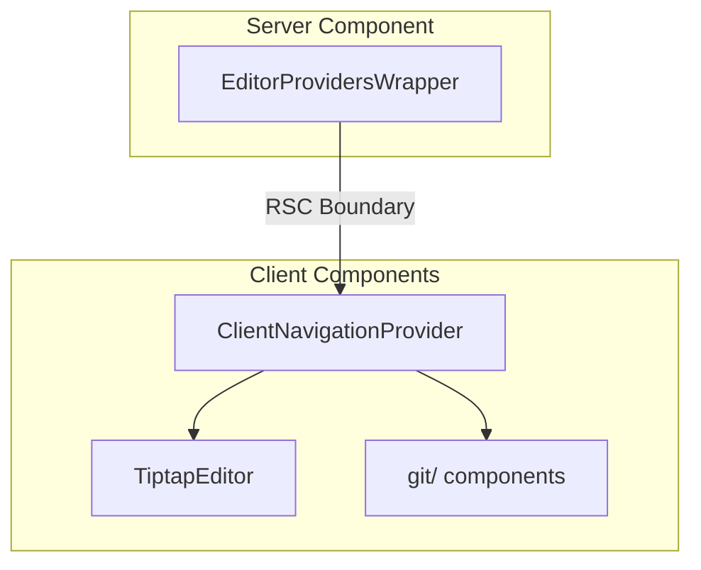

# @fern-dashboard/src/components/editor

<!-- AI: Update the date below when modifying this file -->
*Last updated by AI: 2026-01-14*

Visual editor for Fern documentation pages. Supports MDX editing via Tiptap with Git integration for commits and PRs.

## Architecture

**Key files:**
- `EditorProvidersWrapper.tsx` - Server component that fetches Git data and sets up providers
- `ClientNavigationProvider.tsx` - Client component that initializes navigation and OpenAPI contexts
- `TiptapEditor.tsx` - Main MDX editor using Tiptap

## RSC Serialization

`Map` and `Set` cannot be serialized across the server/client boundary. The following props are converted to arrays in `EditorProvidersWrapper.tsx` and reconstructed in `ClientNavigationProvider.tsx`:

| Prop | Original Type | Serialized As |
|------|---------------|---------------|
| `latestDocsYmlAndReferences` | `Map<string, string>` | `[string, string][]` |
| `openApiSpecs` | `Map<string, string>` | `[string, string][]` |
| `openApiOverrideFilePaths` | `Set<string>` | `string[]` |

## Subdirectories

- `git/` - Commit, PR, and branch management UI
- `editor-component/` - Reusable editor UI primitives
- `extension-*/` - Tiptap extensions (code blocks, custom elements, etc.)
- `tiptap-node/` - Custom Tiptap node views (media upload, syntax highlighting)
- `table/` - Table editing components
