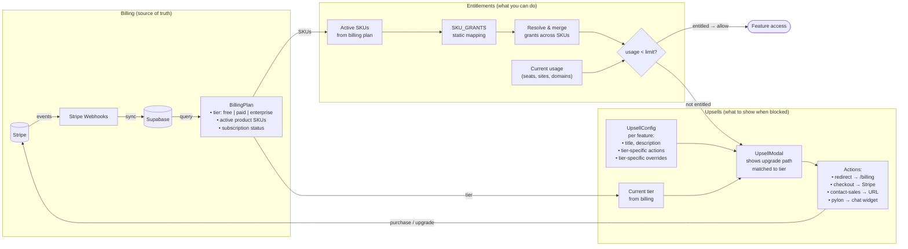
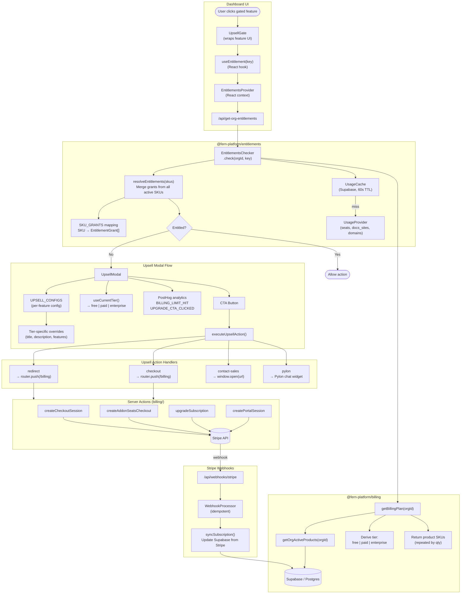

# Upsell / Billing / Entitlements Flow

## How the Three Systems Relate

```mermaid
flowchart LR
    subgraph Billing["Billing (source of truth)"]
        STRIPE[(Stripe)]
        WEBHOOK["Stripe Webhooks"]
        DB[(Supabase)]
        PLAN["BillingPlan\n• tier: free | paid | enterprise\n• active product SKUs\n• subscription status"]

        STRIPE -- "events" --> WEBHOOK
        WEBHOOK -- "sync" --> DB
        DB -- "query" --> PLAN
    end

    subgraph Entitlements["Entitlements (what you can do)"]
        SKUS["Active SKUs\nfrom billing plan"]
        GRANTS["SKU_GRANTS\nstatic mapping"]
        RESOLVE["Resolve & merge\ngrants across SKUs"]
        USAGE["Current usage\n(seats, sites, domains)"]
        CHECK{"usage < limit?"}

        SKUS --> GRANTS
        GRANTS --> RESOLVE
        RESOLVE --> CHECK
        USAGE --> CHECK
    end

    subgraph Upsells["Upsells (what to show when blocked)"]
        CONFIG["UpsellConfig\nper feature:\n• title, description\n• tier-specific actions\n• tier-specific overrides"]
        TIER["Current tier\nfrom billing"]
        MODAL["UpsellModal\nshows upgrade path\nmatched to tier"]
        ACTIONS["Actions:\n• redirect → /billing\n• checkout → Stripe\n• contact-sales → URL\n• pylon → chat widget"]

        CONFIG --> MODAL
        TIER --> MODAL
        MODAL --> ACTIONS
    end

    PLAN -- "SKUs" --> SKUS
    PLAN -- "tier" --> TIER
    CHECK -- "entitled → allow" --> ALLOW([Feature access])
    CHECK -- "not entitled" --> MODAL
    ACTIONS -- "purchase / upgrade" --> STRIPE
```

## Detailed Flow

```mermaid
flowchart TD
    subgraph Dashboard["Dashboard UI"]
        USER([User clicks gated feature])
        GATE["UpsellGate\n(wraps feature UI)"]
        HOOK["useEntitlement(key)\n(React hook)"]
        PROVIDER["EntitlementsProvider\n(React context)"]
        API["/api/get-org-entitlements"]

        GATE --> HOOK
        HOOK --> PROVIDER
        PROVIDER --> API
        USER --> GATE
    end

    subgraph Entitlements["@fern-platform/entitlements"]
        CHECKER["EntitlementsChecker\n.check(orgId, key)"]
        RESOLVE["resolveEntitlements(skus)\nMerge grants from all active SKUs"]
        GRANTS["SKU_GRANTS mapping\nSKU → EntitlementGrant[]"]
        USAGE["UsageProvider\n(seats, docs_sites, domains)"]
        CACHE["UsageCache\n(Supabase, 60s TTL)"]
        RESULT{Entitled?}

        CHECKER --> RESOLVE
        RESOLVE --> GRANTS
        CHECKER --> CACHE
        CACHE -- miss --> USAGE
        RESOLVE --> RESULT
    end

    subgraph Billing["@fern-platform/billing"]
        PLAN["getBillingPlan(orgId)"]
        PRODUCTS["getOrgActiveProducts(orgId)"]
        DB[(Supabase / Postgres)]
        TIER["Derive tier:\nfree | paid | enterprise"]
        SKUS["Return product SKUs\n(repeated by qty)"]

        PLAN --> PRODUCTS
        PRODUCTS --> DB
        PLAN --> TIER
        PLAN --> SKUS
    end

    subgraph Upsell["Upsell Modal Flow"]
        MODAL["UpsellModal"]
        CONFIG["UPSELL_CONFIGS\n(per-feature config)"]
        CURTIER["useCurrentTier()\n→ free | paid | enterprise"]
        OVERRIDES["Tier-specific overrides\n(title, description, features)"]
        CTA["CTA Button"]
        EXEC["executeUpsellAction()"]
        POSTHOG["PostHog analytics\nBILLING_LIMIT_HIT\nUPGRADE_CTA_CLICKED"]

        MODAL --> CONFIG
        MODAL --> CURTIER
        CONFIG --> OVERRIDES
        MODAL --> POSTHOG
        MODAL --> CTA
        CTA --> EXEC
    end

    subgraph Actions["Upsell Action Handlers"]
        REDIRECT["redirect\n→ router.push(/billing)"]
        CHECKOUT["checkout\n→ router.push(/billing)"]
        SALES["contact-sales\n→ window.open(url)"]
        PYLON_ACT["pylon\n→ Pylon chat widget"]

        EXEC --> REDIRECT
        EXEC --> CHECKOUT
        EXEC --> SALES
        EXEC --> PYLON_ACT
    end

    subgraph BillingActions["Server Actions (billing/)"]
        CHECKOUT_SESSION["createCheckoutSession"]
        ADDON_SEATS["createAddonSeatsCheckout"]
        UPGRADE["upgradeSubscription"]
        PORTAL["createPortalSession"]
        STRIPE[(Stripe API)]

        CHECKOUT_SESSION --> STRIPE
        ADDON_SEATS --> STRIPE
        UPGRADE --> STRIPE
        PORTAL --> STRIPE
    end

    subgraph Webhook["Stripe Webhooks"]
        WH_ROUTE["/api/webhooks/stripe"]
        PROCESSOR["WebhookProcessor\n(idempotent)"]
        SYNC["syncSubscription()\nUpdate Supabase from Stripe"]

        WH_ROUTE --> PROCESSOR
        PROCESSOR --> SYNC
        SYNC --> DB
    end

    %% Cross-subgraph connections
    API --> CHECKER
    CHECKER --> PLAN
    RESULT -- No --> MODAL
    RESULT -- Yes --> ALLOW([Allow action])
    REDIRECT --> BillingActions
    CHECKOUT --> BillingActions
    STRIPE -- webhook --> WH_ROUTE
```
