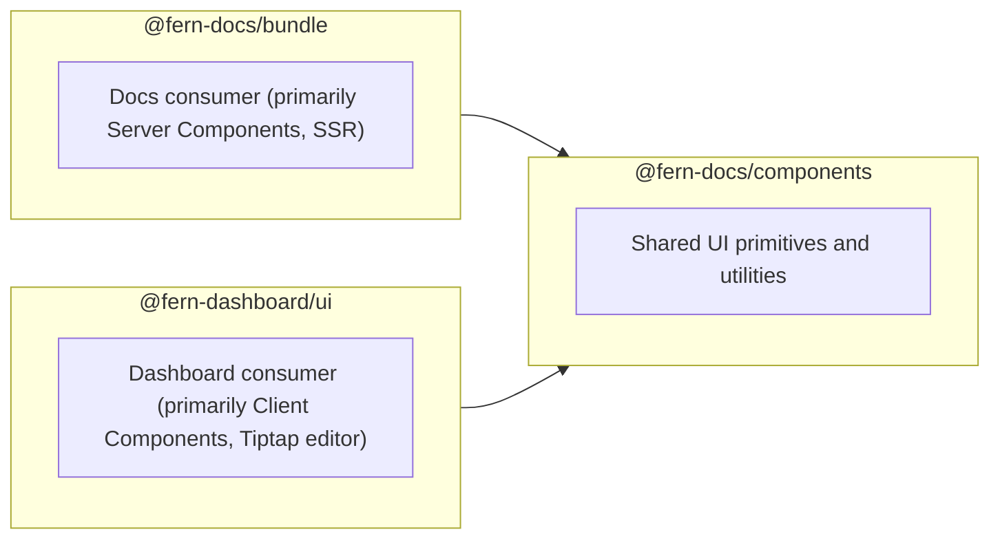

# @fern-docs/components

<!-- AI: Update the date below when modifying this file -->
*Last updated by AI: 2026-02-09*

Shared UI primitives and utilities used by [`@fern-docs/bundle`](../bundle/README.md) and [`@fern-dashboard/ui`](../../fern-dashboard/README.md).

## Where This Package Fits



Note: Dashboard **forks some Docs rendering code** — `fern-dashboard/src/docs/` is a modified subset of `fern-docs/bundle/src` because the rendering strategies differ (Server Components vs. Client Components). See [`fern-dashboard/src/docs/README.md`](../../fern-dashboard/src/docs/README.md) for details.

Eventually, we'd like to create a commons package for this rendering code as a dependency for both `@fern-dashboard/ui` and `@fern-docs/bundle`.


## CSS Imports

Bundle and dashboard have parallel CSS entry points that must include specific imports for components to render correctly:

| Bundle | Dashboard |
|--------|-----------|
| `fern-docs/bundle/src/app/globals.css` | `fern-dashboard/src/app/[orgName]/(visual-editor)/editor/[docsUrl]/[branch]/[...slug]/index.css` |

The `@fern-docs/components/styles` entry point does NOT include all component styles. Some styles must be imported separately or components will render without styling. Examples:

```css
@import "@fern-docs/components/src/syntax-highlighter/index.css";
@import "@fern-docs/components/src/api-reference/index.scss";
@import "@fern-docs/components/src/HorizontalOverflowMask.scss";
```

## API Reference Components

The `src/api-reference/` directory contains shared components for rendering API documentation. Also see:

- **`fern-docs/bundle/src/components/api-reference`**
- [**`fern-dashboard/src/docs/components/api-reference`**](../../fern-dashboard/src/docs/components/api-reference/README.md)

### Parallel Implementation Pattern

Some components require parallel implementations in bundle and dashboard due to differing MDX rendering strategies:

- **Bundle**: Uses server-side MDX rendering via `MdxServerComponentProseSuspense`. Most components are Server Components for optimal performance.
- **Dashboard**: MDX rendering via `MdxContent`. Many components are Client Components with `"use client"` directive.

These components form a recursive rendering tree where type definitions can contain nested types, each requiring MDX-rendered descriptions.

### Components Requiring Parallel Implementations

The following components in `api-reference/type-definitions/` require platform-specific implementations in both bundle and dashboard:

| Component | Purpose | Bundle Location | Dashboard Location |
|-----------|---------|-----------------|-------------------|
| `InternalTypeDefinition` | Renders type shapes (enum, union, object) | `bundle/.../type-definitions/InternalTypeDefinition.tsx` | `dashboard/.../type-definitions/InternalTypeDefinition.tsx` |
| `ObjectProperty` | Renders object properties with MDX descriptions | `bundle/.../type-definitions/ObjectProperty.tsx` | `dashboard/.../type-definitions/ObjectProperty.tsx` |
| `EnumValue` | Renders enum values with MDX descriptions | `bundle/.../type-definitions/EnumValue.tsx` | `dashboard/.../type-definitions/EnumValue.tsx` |
| `DiscriminatedUnionVariant` | Renders discriminated union variants | `bundle/.../type-definitions/DiscriminatedUnionVariant.tsx` | `dashboard/.../type-definitions/DiscriminatedUnionVariantSelector.tsx` |
| `UndiscriminatedUnionVariant` | Renders undiscriminated union variants | `bundle/.../type-definitions/UndiscriminatedUnionVariant.tsx` | `dashboard/.../type-definitions/UndiscriminatedUnionVariant.tsx` |
| `TypeReferenceDefinitions` | Resolves type references and renders definitions | `bundle/.../type-definitions/TypeReferenceDefinitions.tsx` | `dashboard/.../type-definitions/TypeReferenceDefinitions.tsx` |
| `TypeDefinitionSlotsServer` | Provides pre-rendered type slots | `bundle/.../type-definitions/TypeDefinitionSlotsServer.tsx` | `dashboard/.../type-definitions/TypeDefinitionSlotsServer.tsx` |

**Note on union variants:** Bundle supports two rendering modes for unions (toggled by `showUnionsAsDropdown`): a collapsible "OR" list of all variants (`DiscriminatedUnionVariant.tsx` / `UndiscriminatedUnionVariant.tsx`) or a dropdown picker (`*Selector.tsx` files). Dashboard always uses the dropdown mode, so for discriminated unions it only has the Selector file (with per-variant rendering inlined).

### Implementation Pattern

Parallel implementations use **shared utilities**:

1. Bundle/dashboard each implement their own component logic
2. Shared utility and UI primitives (collapse, separators, etc.) are imported from `@fern-docs/components`

This pattern keeps bundle as Server Components for optimal SSR performance while allowing dashboard to use Client Components.

## Navigation Module

`src/navigation/` contains `NavigationStore`, the editor's central client-side state management (page registry, docs.yml changes, OpenAPI pending changes, IndexedDB persistence). Used exclusively by the dashboard editor — not by bundle. See the [editor README](../../fern-dashboard/src/components/editor/README.md#navigationstore-fern-docscomponentsnavigation) for detailed architecture and file reference.
