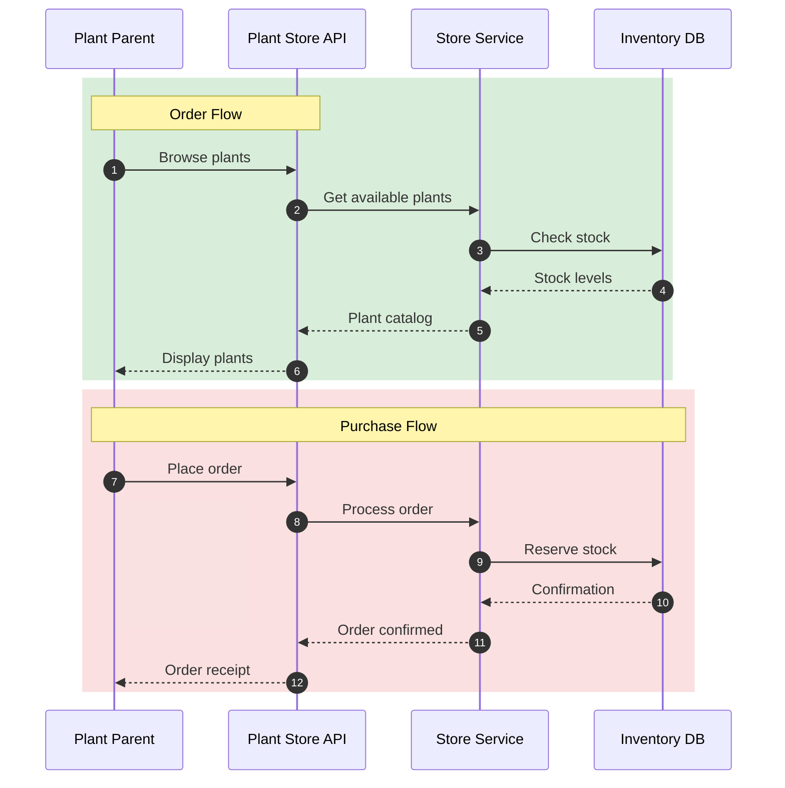

## Redirect Tests

Test the redirect functionality from this page:

- [Old Welcome Page](/old-welcome) - should redirect to the welcome page

### Plant

A plant can be bought from the store. It has a name, a category, a status, and a list of photo URLs.

### Store

A store has a collection of plants. It is responsible for managing the inventory of plants. Users place orders for plants from the store.

### User

A user is a person who buys plants from the store. Also known as plant parents.

### System Architecture

The following diagram shows how the Plant Store system works:

